# Tracker

iOS‑приложение для формирования и контроля регулярных привычек: пользователь сможет создавать индивидуальные трекеры, группировать их по категориям, задавать расписание, фиксировать выполнение действий и анализировать общий прогресс.

Проект самостоятельно реализован по готовым требованиям и дизайн-макетам.

## Демо

https://github.com/user-attachments/assets/9a57d4dc-16d1-43df-8744-a519d5c051ef

## Скриншоты

| Онбординг | Пустой главный экран | Создание трекера |
|:---------:|:--------------------:|:----------------:|
| 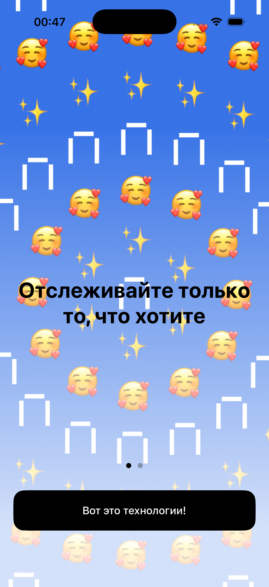 | 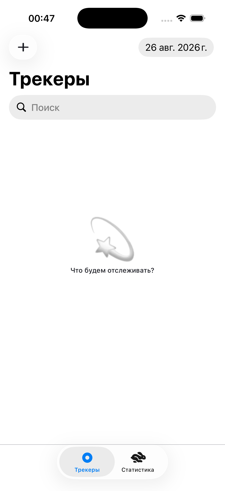 | 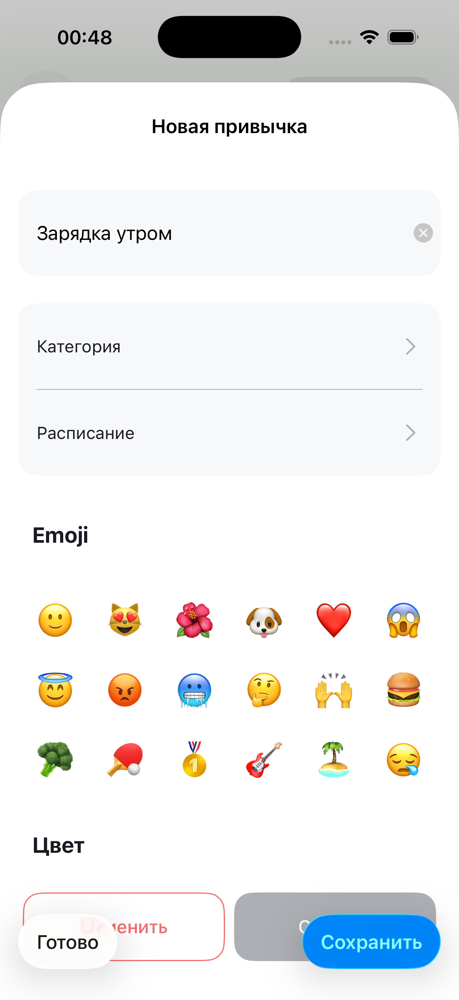 |

| Пустой список категорий | Выбор категории | Настройка расписания |
|:-----------------------:|:---------------:|:--------------------:|
| 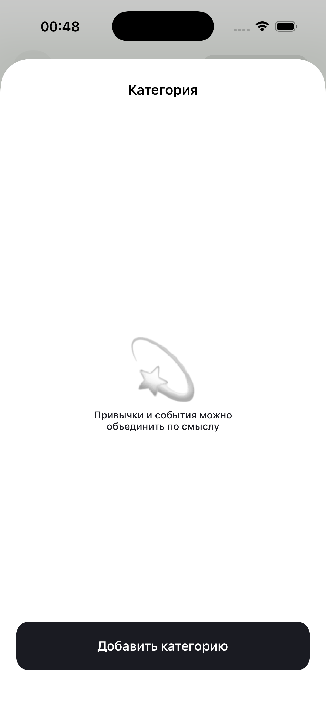 | 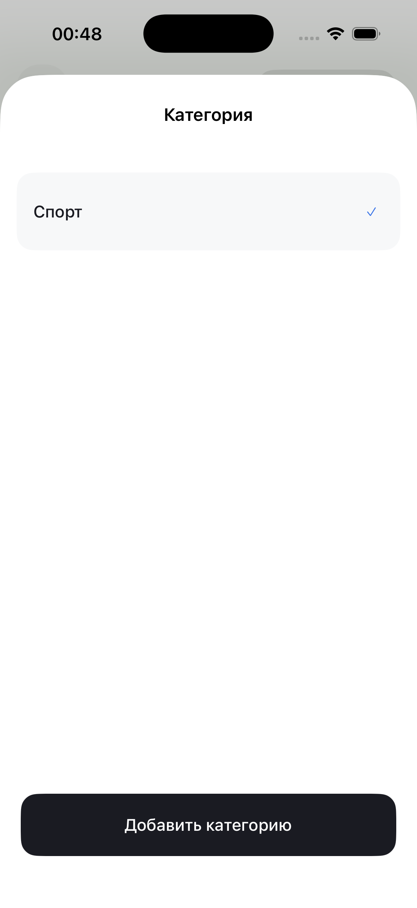 | 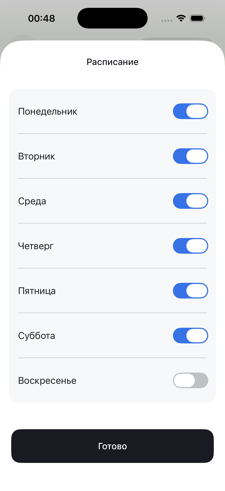 |

| Главный экран | Редактирование трекера | Фильтры |
|:-------------:|:----------------------:|:-------:|
| 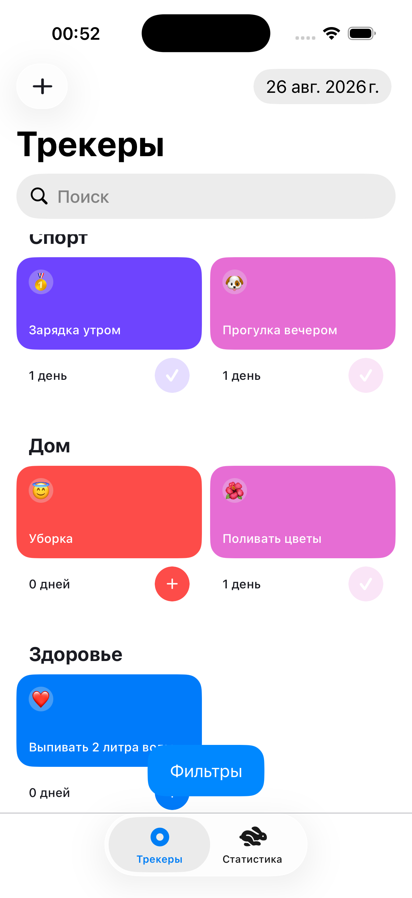 | 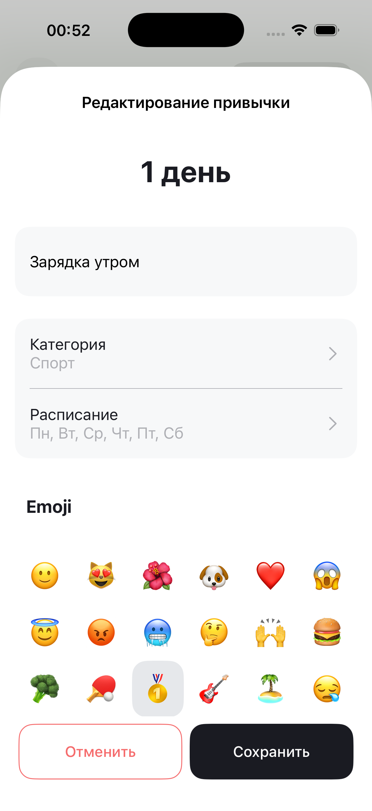 | 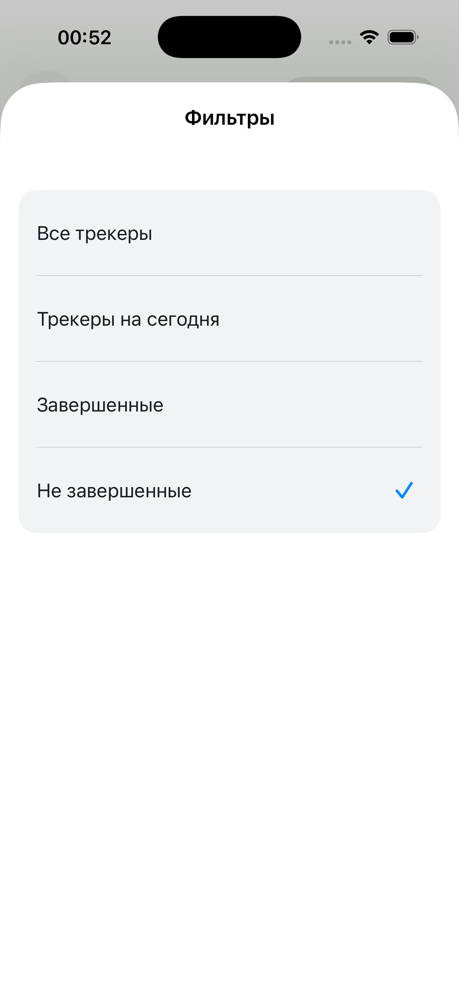 |

| Результат фильтрации | Закрепленные | Статистика |
|:--------------------:|:------------:| :---------:|
| 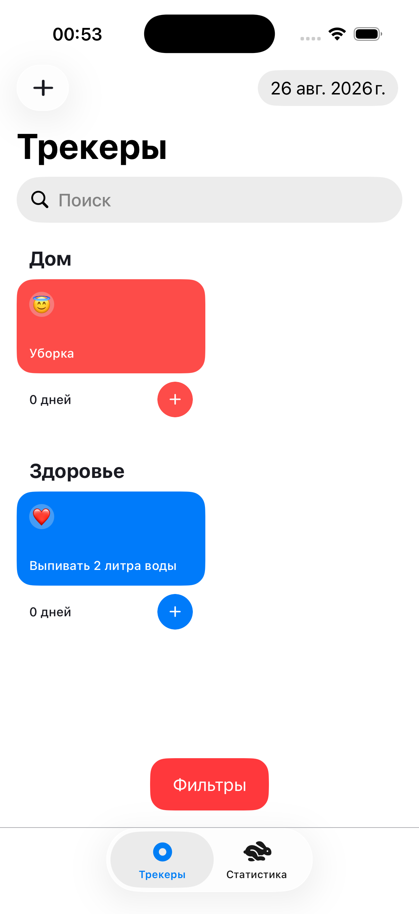 | 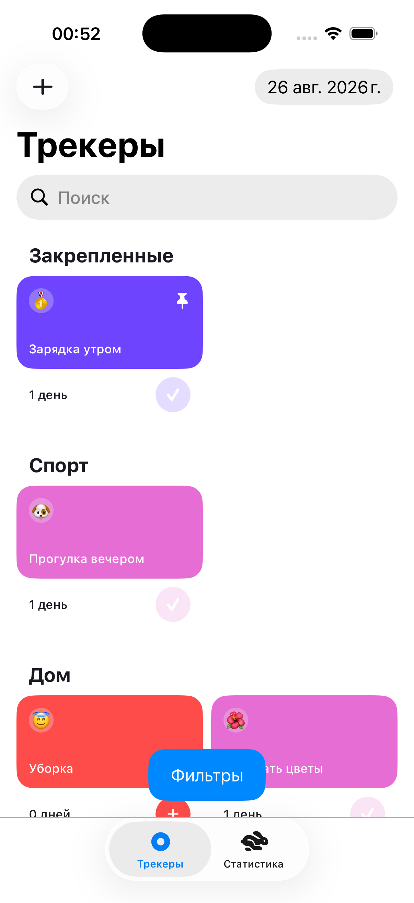 | 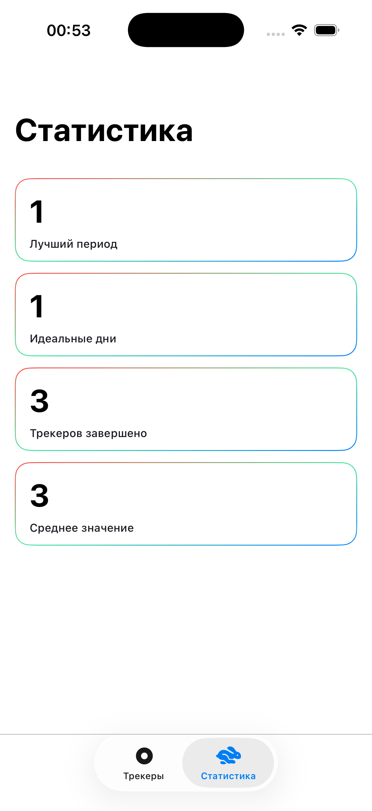

## Ссылки
[Дизайн Figma](https://www.figma.com/design/owAO4CAPTJdpM1BZU5JHv7/Tracker)

[ТЗ приложения](https://github.com/Yandex-Practicum/iOS-TrackerApp-Public)

## Основной функционал:
* Онбординг при первом запуске приложения.
* Создание трекера с названием, категорией и расписанием по дням недели.
* Выбор эмодзи и цвета для оформления карточки.
* Создание и выбор пользовательских категорий.
* Группировка трекеров по категориям.
* Просмотр запланированных трекеров на выбранную дату.
* Поиск трекеров по названию.
* Фильтрация списка: все трекеры, трекеры на сегодня, завершенные и незавершенные.
* Отметка выполнения трекера и отмена отметки.
* Запрет отметки выполнения для будущих дат.
* Подсчет общего количества дней выполнения каждого трекера.
* Редактирование трекера, его расписания, категории и оформления.
* Удаление трекера с подтверждением действия.
* Экран статистики по следующим показателям:
  * «Лучший период» считает максимальное количество дней без перерыва по всем трекерам.
  * «Идеальные дни» считает дни, когда были выполнены все запланированные привычки.
  * «Трекеров завершено» считает общее количество выполненных привычек за все время.
  * «Среднее значение» считает среднее количество привычек, выполненных за 1 день.
* Сохранение трекеров, категорий и истории выполнений между запусками.
* Русская и английская локализация приложения.
* Поддержка системной светлой и темной темы.
* Сбор аналитики основных пользовательских действий.

## Требования и технологии
* iOS 17+
* Swift 5
* UIKit
* Программная верстка и Auto Layout
* MVC/MVVM
* UICollectionView и UITableView
* UITabBarController и UINavigationController
* Core Data
* NSFetchedResultsController
* UserDefaults
* AppMetrica
* XCTest и snapshot-тестирование
* Swift Package Manager

## Swift Package Manager
* AppMetricaCore — сбор продуктовой аналитики и пользовательских событий.
* SnapshotTesting — snapshot-тестирование главного экрана в светлой и темной темах.

## Установка и запуск
1. Клонировать репозиторий:

```bash
git clone https://github.com/Tema82Rus/Tracker.git
```

2. Перейти в папку проекта:

```bash
cd Tracker
```

3. Открыть проект:

```bash
open Tracker.xcodeproj
```

4. Дождаться автоматической загрузки зависимостей через Swift Package Manager.

5. Выбрать симулятор или подключенное устройство с iOS 17+.

6. Собрать и запустить приложение.
